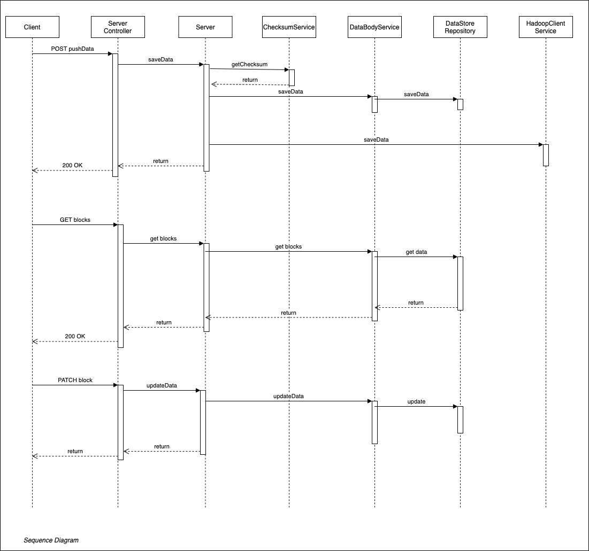

# spring-boot-rest

## Sequence Diagram


## Run in Local
```
git clone https://github.com/kishorechk/spring-boot-rest.git
cd spring-boot-rest
./gradlew bootRun
```

## Run Tests
```
./gradlew test
```
